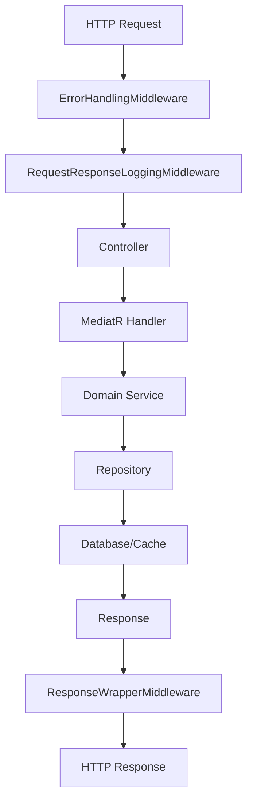
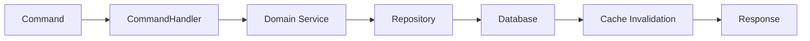
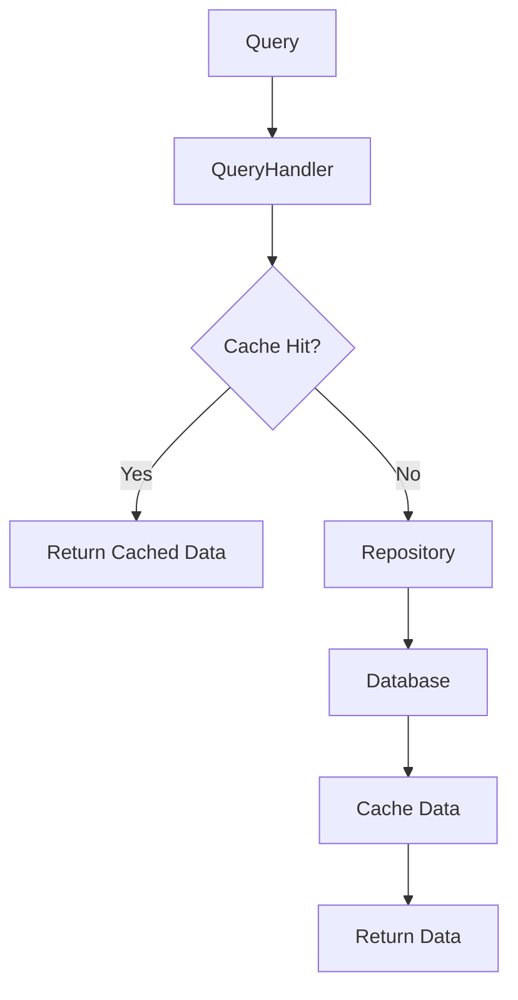
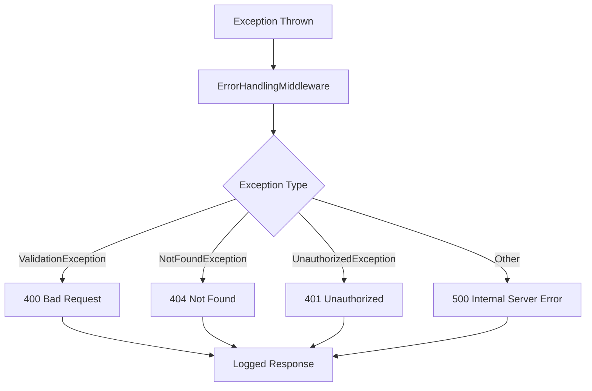
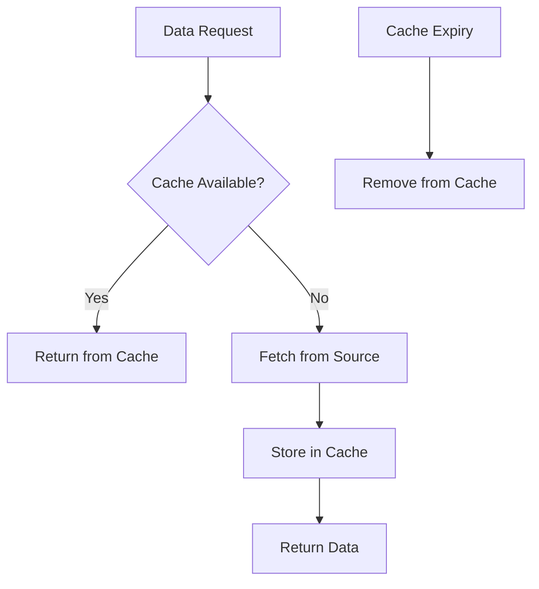
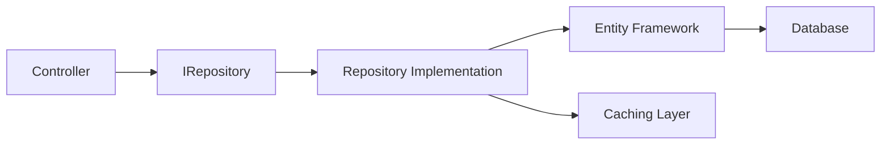

# CommonService Operational Flows

## 1. Request Processing Flow



## 2. CQRS Command Flow



## 3. Query Flow with Caching



## 4. Error Handling Flow



## 5. Service Integration Patterns

### Email Service Flow


### Caching Strategy


## 6. Repository Pattern Implementation



## Key Features:

1. **Middleware Pipeline**: Xử lý lỗi, logging, và response wrapping tự động
2. **CQRS Ready**: Sẵn sàng cho Command/Query separation với MediatR
3. **Caching Strategy**: Hỗ trợ cả In-Memory và Redis caching
4. **Repository Pattern**: Abstraction layer cho data access
5. **Clean Architecture**: Tách biệt rõ ràng các concerns
6. **Service Integration**: Email, SMS, Payment services
7. **Error Handling**: Centralized exception handling
8. **API Documentation**: Swagger/OpenAPI integration

## Usage Examples:

### 1. Adding a new Command
```csharp
public class CreateUserCommand : IRequest<User>
{
    public string Username { get; set; }
    public string Password { get; set; }
}

public class CreateUserCommandHandler : IRequestHandler<CreateUserCommand, User>
{
    private readonly IUserRepository _repository;
    
    public CreateUserCommandHandler(IUserRepository repository)
    {
        _repository = repository;
    }
    
    public async Task<User> Handle(CreateUserCommand request, CancellationToken cancellationToken)
    {
        var user = new User { Username = request.Username, Password = request.Password };
        return await _repository.AddAsync(user);
    }
}
```

### 2. Using Cache Service
```csharp
public class UserService
{
    private readonly ICacheService _cache;
    private readonly IUserRepository _repository;
    
    public async Task<User> GetUserAsync(int id)
    {
        var cacheKey = $"user_{id}";
        var cachedUser = await _cache.GetAsync<User>(cacheKey);
        
        if (cachedUser != null)
            return cachedUser;
            
        var user = await _repository.GetByIdAsync(id);
        await _cache.SetAsync(cacheKey, user, TimeSpan.FromMinutes(30));
        
        return user;
    }
}
```